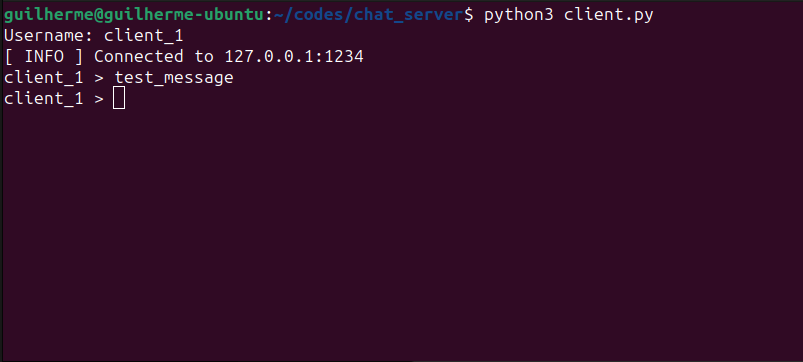
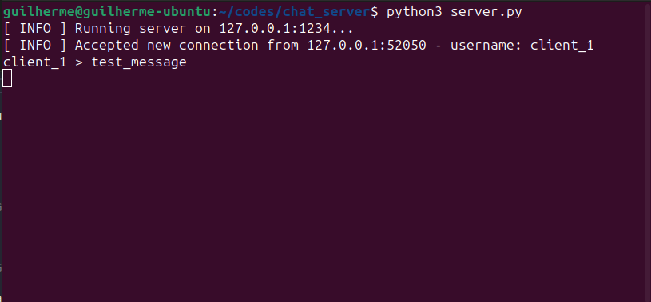
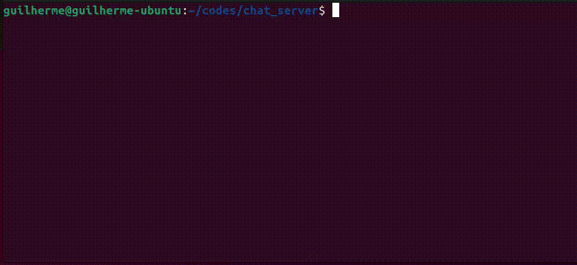
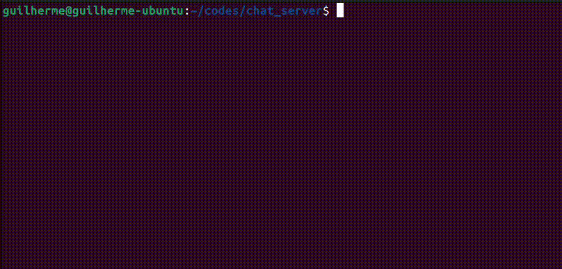
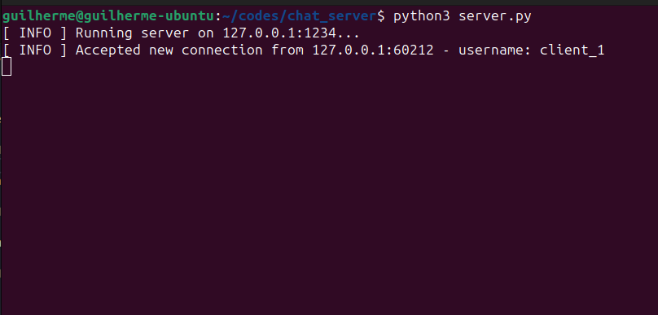
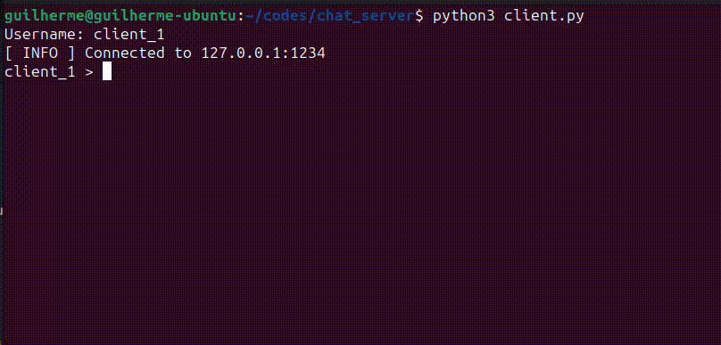
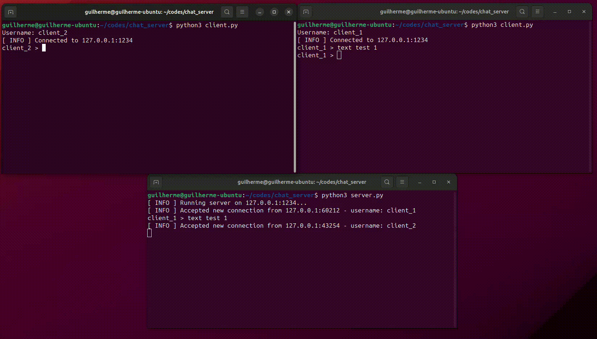

# Socket Chatting

- Python >= 3.11

Python scripts to host a port for connection and start connection of a chat room, designed to use in LAN. Developed for studies of university.

### Setup

Clone the repository and run the 'server.py' file to create a server for the chatting:
- Linux:
    ```
    python3 server.py
    ```

- Windows:
    ```
    py server.py
    ```

The server will start on default ip and port (127.0.0.1:1234). If desire to change the ip and port, add the following to the execution of script:

```
python3 server.py ip=${DESIRED_IP} port=${DESIRED_PORT}
```

You have now the chat room running on your desired terminal. All the messages will be printed in that terminal, along with some log prints.

### Usage

Now that the server is running (the chat room), you have to 'add users' to that server. With that in mind, a 'client.py' script shall be executed, to participate in that server:

```
python3 client.py
```

A username will be requested as a input, followed by a input of your choice. That will be the message the user will send on the chat room.



And after the message is sent, the server will display the message at its terminal:


To end the scripts, just 'Keyboard Interrupt' the execution of scripts.

### Example

Starting the server:

<!-- TODO: ADICIONAR GIF DE INICIANDO SERVER -->


Starting the client:

<!-- TODO: ADICIONAR GIF DE INICIANDO CLIENT -->


Connection confirmed at server:

<!-- TODO: ADICIONAR GIF DE CONFIRMACAO DE CONEXAO -->


Sending a message:

<!-- TODO: ADICIONAR GIF DE TEXTO NO CLIENT -->


Conversation example:

<!-- TODO: ADICIONAR GIF DE PRINT NO SERVER -->


